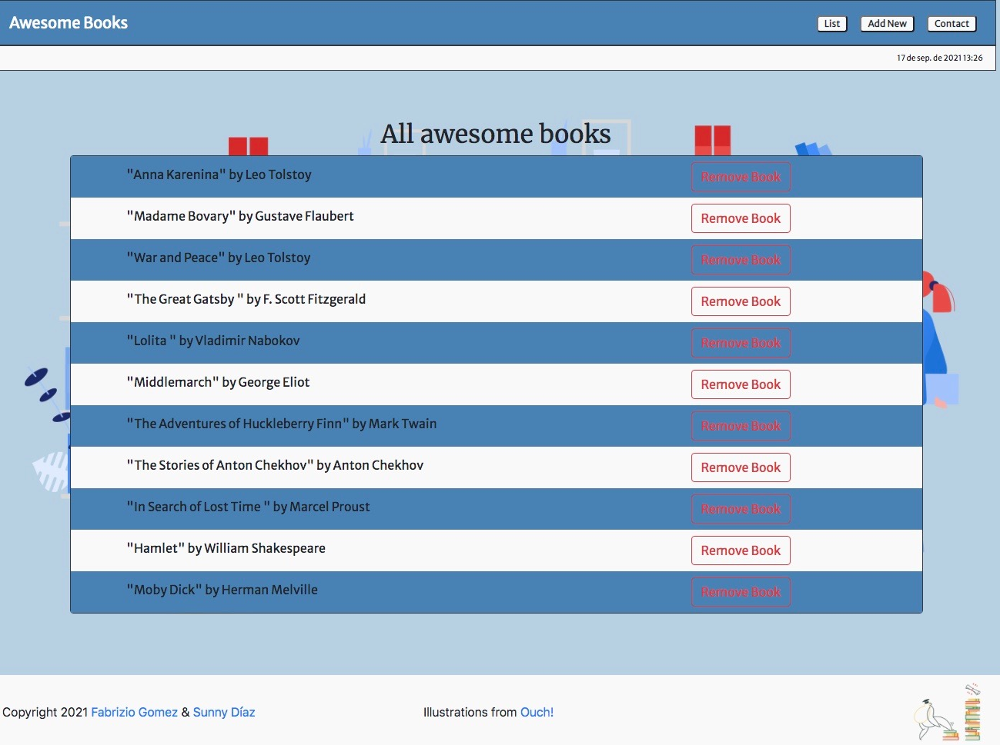

# Awesome Books

> A book managing javascript app.

Add, delete and display your library of books

## Built With

- HTML
- CSS
- JavaScript

## Live Demo

[Live Demo Link](https://katiscoding.github.io/AwesomeBooks/)

## Getting Started

**This is an example of how you may give instructions on setting up your project locally.**
**Modify this file to match your project, remove sections that don't apply. For example: delete the testing section if the currect project doesn't require testing.**

To get a local copy up and running follow these simple example steps.

### Prerequisites
 A modern web browser (Chrome, Firefox, Safari, Microsoft Edge)

### Usage
 Clone the project using `git clone https://github.com/KatIsCoding/AwesomeBooks.git`
 Open with your browser the `index.html` File
 Or simply:
 Go to the [Live Demo Link](https://katiscoding.github.io/AwesomeBooks/) provided and start storing your books
 
## Run tests
 Clone the project using `git clone https://github.com/KatIsCoding/AwesomeBooks.git`
 Run `npx hint .` for html linters
 Run `npx eslint .` for javascript linters
 Run `npx stylelint "**/*.{css,scss}"` for style linters
 
## Deployment
 Clone this repository in one of yours
 Got to Repo settings
 Click on Pages
 Select your branch
 Click Save
 After some time your website version should be live and public

## Authors

👤 **Sunny Díaz**

- GitHub: [@SunnySparks](https://github.com/SunnySparks)
- Twitter: [@JosfranT6](https://twitter.com/JosFranT6)
- Instagram: [@webdev.sunnydiaz](https://www.instagram.com/webdev.sunnydiaz/)
- Portfolio: [sunnydiaz.com](https://sunnydiaz.com/)
- LinkedIn: [LinkedIn](https://www.linkedin.com/in/jose-f-silva/)

👤 **Fabrizio Gomez**

- GitHub: [@KatIsCoding](https://github.com/KatIsCoding)
- Twitter: [@fabriziogr211](https://twitter.com/fabriziogr211)
- LinkedIn: [Fabrizio Gomez](https://www.linkedin.com/in/fabrizio-gomez-6a00801a3/)

## 🤝 Contributing

Contributions, issues, and feature requests are welcome!

Feel free to check the [issues page](https://github.com/KatIsCoding/AwesomeBooks/issues).

## Show your support

Give a ⭐️ if you like this project!

## Acknowledgments

- Creating and accessing to HTML elements via DOM
- JavaScript best practices

## 📝 License

This project is [MIT](./MIT.md) licensed.
